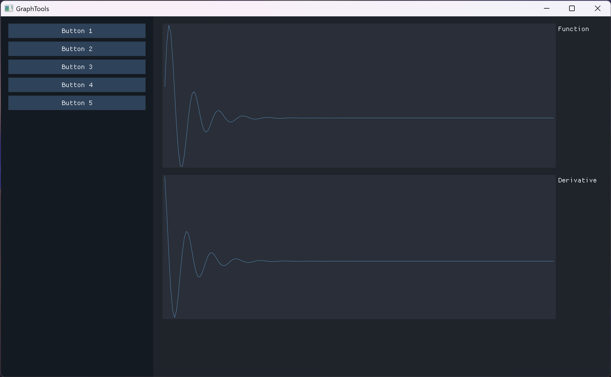

```cpp
#include "window.hpp"

using namespace FactoryUnit;

int main() {
    auto manager = WindowManager::Create();
    auto window = Create<WindowUnit>(Pixels(2200, 1300), "GraphTools");

    auto toolbar = Create<PanelUnit>(Percent(25, 100), "Toolbar");
    toolbar->SetColor(0.08f, 0.10f, 0.13f, 1.00f);
    for (int i = 1; i <= 5; ++i) {
        auto button = Create<ButtonUnit>(Percent(90, 4), "Button " + std::to_string(i));
        button->SetPos(Percent(5, 5 * (i - 1) + 2));
        toolbar->Push(std::move(button));
    }

    std::vector<float> v1, v2;
    for (float i = - 10; i <= 10; i += 0.1) {
        v1.push_back(std::exp(-i) * std::sin(5 * i));
        v2.push_back(std::exp(-i) * (5 * std::cos(5 * i) - std::sin(5 * i)));
    }

    auto graphs = Create<PanelUnit>(Percent(75, 100), "Graphs");
    graphs->SetPos(Percent(25, 0));

    auto function = Create<GraphUnit>(Percent(86, 40), "Function");
    function->SetPos(Percent(2, 2));
    function->SetValues(std::move(v1));
    graphs->Push(std::move(function));

    auto derivative = Create<GraphUnit>(Percent(86, 40), "Derivative");
    derivative->SetPos(Percent(2, 44));
    derivative->SetValues(std::move(v2));
    graphs->Push(std::move(derivative));

    window->Push(std::move(toolbar));
    window->Push(std::move(graphs));

    manager->Push(std::move(window));
    manager->Run();
}